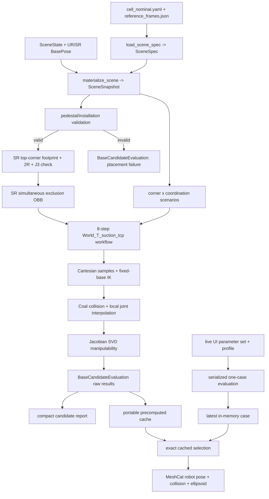

# Decanting workspace 아키텍처

이 문서는 코드의 책임 경계와 데이터 흐름을 설명한다. 새 컴퓨터에서 프로젝트를 이어서 실행하는 절차와 현재 개발 상태는 [HANDOFF.md](HANDOFF.md)를 참고하고, 사용자용 명령 예시는 [README.md](../README.md)를 참고한다.

## 1. 시스템 목표와 현재 경계

이 프로젝트는 한쪽 decanting cell에서 다음 설계변수를 반복 변경하며 로봇 배치 후보를 평가하기 위한 Python 기반 계산 계층이다.

- UR20 base의 `x`, `y`, 장착 높이 `z`, yaw
- FANUC SR-12iA base의 `x`, `y`, 장착 높이 `z`, yaw
- 팔레트 리프트 높이
- tote 적재 위치
- 실제 SKU 크기와 팔레트의 네 개 corner 대안
- SR-12iA J3 300/450 mm 옵션
- 동시 작업과 순차 작업

UR20은 Pinocchio의 고정-base IK, Coal 충돌 검사, Jacobian 기반 manipulability를 평가한다. SR-12iA는 manipulability를 목적값으로 사용하지 않고, 박스 절단에 허용된 보수적 작업영역과 평면 2R/J3 도달 가능성을 검사한다.

현재 계층은 **최적화 직전**까지를 담당한다. 후보별 제약 결과와 metric을 생성하지만 다음 항목은 의도적으로 아직 정의하지 않는다.

- 목적함수와 metric 가중치
- 후보 순위와 최적화 알고리즘
- 최종 base 탐색 범위 및 간격
- 전역 motion planning과 실제 controller 실행

Isaac Sim, ROS, MoveIt은 실행 의존성이 아니다. 기본 실행에서는 `cu_usd_simplified.usd`와 `BGF`를 provenance로 두고 `config/`를 읽는다. `--usd` 또는 `usd_scene`을 지정하면 `usd_scene.py`가 선택한 USD 환경을 World metre 삼각형 `MeshObstacle`로 읽어 고정 환경의 표시·충돌 형상을 대체한다. 공정 frame, URDF와 이동 물체는 config를 유지한다. 선택적인 `box_prims` 연결은 공정 지지면의 경계 치수와 논리 접촉 이름을 USD와 동기화한다. 상세 사용법은 [USD_SCENES.md](USD_SCENES.md)를 참고한다.

## 2. 핵심 계약

### 좌표계와 단위

- 계산 내부 단위는 metre와 radian이다.
- World는 Z-up이고 바닥은 `World Z = 0`이다.
- frame transform은 `World_T_child` 의미를 사용한다.
- JSON quaternion 순서는 `x, y, z, w`이다.
- `BasePose`는 `(x_m, y_m, z_m, yaw_deg)`이며 바닥에 수직으로 설치된 base만 표현한다.
- CLI의 `*-mm`, `*-deg` 입력은 경계에서 SI 단위로 변환한다.
- UR20 작업 target은 flange의 `tool0`가 아니라 suction 접촉면에 생성한 `suction_tcp`를 기준으로 한다.

### 계산과 시각화 분리

- 후보 반복 중에는 visual mesh를 로드하지 않는다.
- UR20과 SR-12iA `RobotBundle`은 반복문 바깥에서 한 번 로드해 재사용한다.
- cache playback의 MeshCat 계층은 저장된 결과만 검토하며 IK를 다시 풀지
  않는다.
- 별도 live 계층은 입력 한 세트를 local Python backend에서 계산한 뒤 최신
  결과 하나만 메모리에 보관해 같은 step/check/sample presenter로 표시한다.
- evaluation model과 display-only model을 구분한다. 특히 준비된 FANUC SR
  mesh는 표시 전용이며 cache와 live의 kinematic/collision 판정을 바꾸지
  않는다.

### 불변 데이터 우선

설정, scene snapshot, workflow spec, 평가 결과는 대부분 frozen dataclass로 전달한다. 동적 박스/tote 상태는 명목 scene을 수정하지 않고 각 workflow check의 `ObjectState`와 `CollisionPhase`에서 표현한다.

## 3. 저장소 구조

| 경로 | 책임 |
| --- | --- |
| `config/cell_nominal.yaml` | 환경 치수, SKU, tote, pedestal, robot nominal pose와 SR 작업영역의 authoritative config |
| `config/reference_frames.json` | World 기준 공정 frame |
| `src/decanting_workspace/usd_scene.py` | 선택적인 일반 USD 환경 import, 변환/단위/instance 처리와 공정 지지면 연결 |
| `config/case_grid_*.yaml` | 유한 precompute Cartesian product |
| `assets/robots/ur20/official/` | Git에 포함되는 공식 UR20 URDF, visual/collision mesh, license, provenance |
| `assets/robots/ur20/ur20_primitive.urdf` | offline 진단용 mesh-free fallback |
| `assets/robots/sr12ia/sr12ia_approx.urdf` | 300/450 mm 평가가 가능한 보수적 2R-P-R fallback |
| `assets/robots/sr12ia/download_manifest.json` | opt-in download의 pinned URL, source SHA-256, license metadata |
| `.cache/README.md` | tracked cache 정책과 workstation bootstrap 안내 |
| `.cache/robot_assets/sr12ia/` | 각 PC가 라이선스 동의 후 생성하는 SR mesh bundle; Git 미포함 |
| `src/decanting_workspace/` | scene, kinematics, evaluation, cache, UI 구현 |
| `outputs/` | 재현 가능한 report와 precomputed cache snapshot |
| `tests/` | config부터 cache playback/live UI까지 계층별 계약 테스트 |
| `BGF/` | 선택적으로 초기화하는 상위 프로젝트 reference submodule; runtime 불필요 |

`.cache/README.md` 외의 `.cache` 내용, Miniconda의 named environment,
`.pytest_cache`는 로컬에서 다시 만들 수 있는 상태다. 어떤 runtime-required
source도 원래 개발 PC의 절대 경로를 요구해서는 안 된다.

### 3.1 Python module map

| Module | 책임 |
| --- | --- |
| `models.py` | scene/config schema 검증과 core dataclass |
| `paths.py` | checkout root 탐색, `DECANTING_WORKSPACE_ROOT` override, portable artifact reference |
| `transforms.py` | quaternion, yaw, homogeneous transform helper |
| `scene.py` | state와 base로 `SceneSnapshot` materialization |
| `robots.py` | relocatable URDF load, free-flyer root, operational frame/tool proxy, official UR20 bundle 검증 |
| `asset_prep.py` | pinned/local SR USD 취득, OBJ/URDF 변환, provenance와 bundle 검증 |
| `setup_cli.py` | clean-checkout asset 준비 및 config/model/cache/report doctor |
| `placement.py` | installation rectangle와 pedestal 배치 검사 |
| `scara_workspace.py` | SR box-top footprint, 2R branch, J3 feasibility |
| `collision.py` | simultaneous 작업용 SR exclusion OBB |
| `workflow.py` | 공정 target, moving object, contact, criticality 계약 |
| `kinematics.py` | fixed-base IK, arm Jacobian, manipulability SVD |
| `collision_world.py` | phase별 Pinocchio/Coal collision world와 pair 구성 |
| `evaluation.py` | pose/joint sampling, IK/collision/metric 평가 |
| `candidates.py` | 한 base/state 후보의 전체 orchestration과 coordination summary |
| `precompute.py` | finite grid enumeration, portable cache schema/fingerprint/merge |
| `precompute_cli.py` | grid 기반 batch 계산 entry point |
| `candidate_cli.py` | 단일 후보 compact report entry point |
| `viewer.py` | scene와 robot MeshCat rendering, suction proxy 추종 |
| `meshcat_playback.py` | cached q와 ellipsoid 표시, solid/wireframe material 전환 |
| `playback_controller.py` | exact case/step/check/sample과 display-only option 선택 |
| `playback_backend.py` | cache selection과 scene/viewer 연결, display model 계약 검증 |
| `meshcat_ui.py` | 직렬화된 local HTTP catalog/select/evaluate server, Windows control-port 배타 바인딩 |
| `playback_cli.py` | portable cache 검증과 immutable playback server entry point |
| `live_backend.py` | 단일 parameter evaluation, in-memory one-case adapter, profile 계약 |
| `live_ui.py` | schema 기반 15개 parameter control, 계산 요약, 500 ms latest-only browser queue |
| `live_cli.py` | on-demand evaluation bundle/viewer/server entry point와 control/viewer URL 역할 안내 |
| `cli.py` | cache와 무관한 단일 scene 시각화 entry point |

## 4. 전체 데이터 흐름



### 4.1 설정과 scene materialization

`models.py`는 YAML/JSON schema와 단위를 검증하고 `SceneSpec`, `SceneState`, `BasePose`, `BoxPrimitive`를 생성한다. config 안의 파일 경로는 config 파일의 디렉터리를 기준으로 해석한다.

`scene.py`는 한 state/base 조합을 `SceneSnapshot`으로 만든다.

- 고정 conveyor, worktable, camera support
- 팔레트와 선택한 실제 SKU 박스
- tote와 이동된 `ToteLoadFrame`
- 두 로봇의 바닥-대-base pedestal
- SR module camera support

팔레트의 네 corner는 네 개의 독립적인 물리 시나리오다. `corner=all` 시각화에서는 대안 박스를 반투명으로 표시하지만 충돌 world에 네 박스를 동시에 넣지 않는다.

### 4.2 설치 가능성 검사

`placement.py`는 계산 비용이 큰 IK보다 먼저 다음을 검사한다.

- pedestal footprint가 installation rectangle 안에 있는가
- pedestal과 고정 물체가 겹치는가
- 두 pedestal이 서로 겹치는가
- 선택 clearance를 만족하는가

여기서 실패한 후보는 상세 `PlacementIssue`를 반환하고 이후 kinematics를 실행하지 않는다.

### 4.3 SR-12iA 보수적 검사

`scara_workspace.py`는 `UncasingLoadFrame`에 실제 SKU를 놓고 윗면 네 corner 각각에 대해 다음을 검사한다.

1. SR support cube 상면으로 정의한 절단 footprint 안에 있는가
2. 설정된 `q1`, `q2` 범위를 만족하는 평면 2R branch가 있는가
3. box top Z가 선택한 J3 stroke 범위 안에 있는가

이 footprint는 SCARA의 전체 기계적 reach나 swept volume이 아니다. 동시 작업의 UR20 충돌 보수성은 `collision.py`가 지정된 SR 절단 자세의 collision geometry와 task footprint를 합친 별도 OBB로 제공한다. 현재 workflow에서는 SR 절단과 겹치는 step 3, 4에 이 OBB를 추가하며, 순차 작업에서는 추가하지 않는다.

### 4.4 UR20 workflow

`workflow.py`는 수치 IK 없이 모든 target, 움직이는 물체, 허용 접촉을 만든다. 현재 `WORKFLOW_SCHEMA_VERSION`은 `3`이다.

| Step | Criticality | Step/check 계약 |
| --- | --- | --- |
| 1 | HARD | `pick_box_from_pallet`: `pallet_box_approach`, `pallet_box_lift`; top-down |
| 2 | HARD | `place_box_at_uncasing`: `uncasing_box_preplace`, `uncasing_box_release_retreat`; World yaw +180° |
| 3 | HARD | `pick_empty_tote_from_level_2`: `level_2_tote_front_approach`, `level_2_tote_lift`; 정면 grasp 후 수직 lift |
| 4 | HARD | `place_tote_on_worktable`: `worktable_tote_preplace`, `worktable_tote_release_retreat` |
| 5 | HARD | `pick_opened_box_from_uncasing`: `opened_box_front_approach`, `opened_box_front_retreat`, `opened_box_lift`; 열린 상면을 피한 정면 grasp |
| 6 | SKIP | `pour_box_contents_into_tote`; 순서 marker이며 pose 검사는 아직 없음 |
| 7 | SOFT | `discard_empty_box_to_level_3`: `waste_release_pose`와 dimension fit; 실패해도 base를 폐기하지 않음 |
| 8 | HARD | `push_filled_tote_to_level_1`: `filled_tote_push_approach`, `filled_tote_push_to_supply`, `filled_tote_final_pose_at_supply` |

Step 8의 마지막 check는 sampled push가 앞에서 실패하더라도 정확한 `ToteSupplyFrame` 자세를 독립적으로 검사한다. collision과 ellipsoid는 저장하지만 이미 push endpoint에 포함된 자세를 metric 평균에 두 번 넣지 않도록 `include_in_metric_summary=false`다.

### 4.5 IK, collision, manipulability

`robots.py`는 robot을 free-flyer root와 arm으로 로드한다. base candidate는 root configuration에 기록되지만 `kinematics.py`의 IK와 Jacobian은 arm slice만 사용한다.

IK는 deterministic multi-start damped least squares다. seed 순서는 이전 성공 waypoint, nominal arm pose, 사용자 seed, joint-limit centre/zero fallback을 포함한다. `not_found`는 이 탐색이 해를 찾지 못했다는 뜻이며 전역적으로 해가 없다는 증명이 아니다.

`evaluation.py`는 각 직선 pose check를 translation/rotation 간격에 맞춰 sampling하고, 인접 IK 해 사이도 joint space에서 검사한다. 이것은 local diagnostic path이며 station 사이의 전역 motion planner가 아니다.

`collision_world.py`는 SRDF가 없는 URDF에 대해 collision pair를 명시적으로 구성한다.

- 비인접 robot self-collision
- robot 대 static/pedestal/floor
- robot 및 world 대 운반 중 box/tote
- task별로 제한된 suction/support 접촉 예외

Manipulability는 `suction_tcp`의 `LOCAL_WORLD_ALIGNED` arm Jacobian SVD로 계산한다.

- translational ellipsoid: `Jv`의 singular values, product, minimum, condition number
- normalized 6-D metric: angular row에 characteristic length를 곱한 뒤 SVD
- scenario summary: 성공한 HARD check sample만 사용

이 계층은 metric을 보존할 뿐 목적함수로 결합하지 않는다.

### 4.6 후보 집계

`candidates.py`의 `evaluate_base_candidate`가 다음 순서를 보장한다.

1. scene materialization과 base placement 검사
2. SR cutting workspace 검사
3. 선택 J3 option 적용과 simultaneous exclusion 생성
4. corner × coordination scenario 확장
5. UR20 workflow 생성 및 평가
6. coordination별 raw summary 생성

선택된 모든 corner의 HARD step이 성공해야 `hard_feasible=true`다. 여기에 SR cutting report도 성공해야 `cell_feasible=true`다. simultaneous와 sequential은 별도 결과로 유지한다.

## 5. Robot asset 아키텍처

### 5.1 UR20

공식 UR20 bundle은 Git에 포함한다.

```text
assets/robots/ur20/official/
├── ur20.urdf
├── meshes/
│   ├── visual/
│   └── collision/
├── LICENSE-BSD-3-Clause.txt
├── LICENSE-UR-GRAPHICAL-DOCUMENTATION.txt
└── PROVENANCE.json
```

URDF mesh 참조는 bundle 내부 상대경로만 사용한다. `resolve_official_ur20()`의 기본 동작은 이 vendored bundle을 검증해 반환하므로 새 PC와 offline 환경에서도 같은 model byte를 사용한다. 명시적인 `cache_dir=...` 호출만 pinned upstream commit을 갱신/검증하는 유지보수 경로다. primitive URDF는 deterministic fallback이지 production 결과의 기본 모델이 아니다.

UR description source의 BSD-3-Clause license와 visual mesh에 적용되는 Universal Robots Graphical Documentation Terms and Conditions는 서로 다른 조건이다. vendored bundle과 배포본에는 두 문서가 모두 유지되어야 하며 `PROVENANCE.json`의 source/hash 정보를 보존해야 한다.

UR20 suction은 아직 임시 치수다. collision model에는 `tool0`에 부착한 stem/pad와 `suction_tcp`가 추가된다. 공식 mesh에 포함되지 않은 viewer proxy는 모든 표시 configuration 이후 `tool0` FK callback으로 함께 움직인다.

### 5.2 FANUC SR-12iA

SR manufacturer geometry는 FANUC 3D Content Sharing Agreement 때문에 Git에 포함하지 않는다. 각 PC에서 명시적으로 라이선스에 동의한 사용자가 `assets/robots/sr12ia/download_manifest.json`에 고정된 NVIDIA source를 SHA-256 검증 후 내려받아 변환하거나, 권한 있는 local `geometries.usd`를 제공한다.

```powershell
decanting-setup --accept-fanuc-license
# 또는
decanting-setup --sr12ia-usd C:\path\to\geometries.usd
```

직접 asset만 준비할 때는 다음 저수준 명령도 지원한다.

```powershell
decanting-assets --download --accept-fanuc-license
decanting-assets C:\path\to\geometries.usd
```

결과는 `.cache/robot_assets/sr12ia/`에 생성된다. 생성 URDF는 같은 bundle의 bare relative mesh filename만 허용한다. validator는 URI, 절대경로, backslash, bundle 밖으로 나가는 경로, 누락되거나 예상 집합과 다른 mesh, converter/J3 provenance 불일치를 거부한다. Python 경계는 `download_sr12ia_geometry`, `prepare_sr12ia_assets`, `validate_prepared_sr12ia_asset`으로 분리되어 있다.

prepared mesh는 300 mm J3 visual model이다. 450 mm feasibility는 conservative evaluation model에 귀속되며, display-only model의 native 300 mm 범위를 넘는 cached posture는 clamp하지 않고 거부한다. 평가 모델과 표시 모델은 arm joint 이름/순서/type, `nq`/`nv`, 여러 probe에서의 `tool0` FK가 일치해야 한다.

SR cache가 없을 때 계산은 tracked approximate model로 가능하지만 실제 mesh 검토는 준비가 끝날 때까지 불가능하다. `decanting-setup`은 기본적으로 기존 bundle과 model/config/cache 계약을 검사하며, bundle이 없다면 명확히 실패한다. 자동 준비는 라이선스 동의 flag가 있을 때만 수행한다.

## 6. Precompute cache, playback, live evaluation

`precompute.py`는 YAML에 명시된 유한 Cartesian product만 계산한다. `CaseKey`와 stable ID는 loop index가 아니라 실제 base/state 물리값으로 구성된다.

현재 schema 계약은 다음과 같다.

| Artifact | Version |
| --- | --- |
| scene YAML | 1 |
| reference-frame JSON | 1 |
| case-grid YAML | 1 |
| workflow | 3 |
| precompute cache | 2 |
| candidate report | 1 |
| SR converter | 3 |
| SR provenance | 1 |

Cache fingerprint는 다음을 canonical JSON으로 만들어 SHA-256 처리한다.

- absolute checkout path를 제거한 parsed `SceneSpec`
- checkout 경로를 제거한 evaluation URDF XML과, URDF가 참조하는 로컬
  mesh/texture 각각의 content SHA-256
- `WORKFLOW_SCHEMA_VERSION`

따라서 동일한 checkout 내용은 어느 디렉터리에 clone해도 같은 fingerprint를 갖고, config/model/workflow가 바뀐 stale cache는 playback 전에 거부된다. tracked cache는 원래 PC의 절대경로를 포함하지 않으며 다른 PC에서 그대로 검증하고 재생할 수 있다. candidate report의 model 표기도 repo-relative logical reference 또는 stable model ID를 사용한다.

Cache에는 UI 재생에 필요한 다음 정보가 들어 있다.

- exact case axes와 base/state
- step/check/sample hierarchy
- target와 solved TCP pose
- 성공 configuration `q` 또는 실패 진단 configuration
- collision contact, nearest pair, minimum distance
- ellipsoid singular values와 World-aligned directions
- SR workspace/keepout 및 coordination summary

`playback_controller.py`는 exact case → step → check → sample 선택을 해석한다. `playback_backend.py`는 선택된 case로 scene primitive를 갱신하고 cached `q`를 표시한다. `meshcat_playback.py`는 ellipsoid를 복원하고, `meshcat_ui.py`는 local HTTP control page를 제공한다.

Cached와 live control page의 Task pose 영역은 ellipsoid 표시 여부, scale,
wireframe을 공통으로 제어한다. `Wireframe ellipsoid`는 기본적으로 꺼져 있어
기존 반투명 solid 표시를 유지한다. JSON API의 `ellipsoid_wireframe`은 기본값이
`false`인 strict boolean이며 계산 parameter가 아닌 display-only option이다.
변경 요청은 `/api/select`로 현재 sample을 다시 표시할 뿐 IK, collision,
manipulability를 다시 계산하지 않는다. 같은 style은 기존 sphere geometry와
material을 재사용하고, solid/wireframe style이 바뀔 때만 material을 다시 만든다.

Robot mesh는 UI 시작 시 한 번만 로드된다. 실패한 IK sample은 diagnostic configuration과 target frame을 표시할 수 있지만 feasible pose로 취급하지 않으며 ellipsoid를 숨긴다. Step 6은 이전 성공 자세를 유지하면서 pose check가 없음을 표시한다.

### 6.1 On-demand live evaluation

`live_cli.py`는 config와 `--initial-grid`를 읽지만 grid의 첫 `CaseKey`는 UI
초기값으로만 사용한다. UR20/SR evaluation `RobotBundle`과 display model을
startup에서 한 번 로드한 뒤 `LiveEvaluationBackend`에 전달한다. 기존
precomputed cache를 읽지 않고 새 cache 파일도 쓰지 않는다.

한 live request의 흐름은 다음과 같다.

1. UI의 flat parameter mapping을 검증해 `BasePose`, `SceneState`, 단일 corner와
   coordination mode의 `CaseKey`를 만든다.
2. 정확히 한 case인 `CaseGrid`로 기존 `precompute_cases`/candidate evaluator를
   호출한다.
3. 결과를 메모리의 one-case `PrecomputedCache` 형태로 변환해 검증된
   `CachedPlaybackBackend`와 presenter를 재사용한다.
4. 최신 backend와 stable case ID만 보관한다. 이후 step/check/sample 선택은
   이 결과를 재생하며 다시 평가하지 않는다.

브라우저 초기화 계약은 `GET /api/catalog` → profile 생성 → parameter control
생성 → 최초 `/api/evaluate` 순서다. Catalog는 다음 15개 계산 입력을 flat
schema와 초기값으로 제공한다. Ellipsoid 표시, scale, wireframe은 이 수에
포함되지 않는 display-only control이다.

- UR20/SR-12iA 각각의 `x`, `y`, `z`, `yaw`
- SKU, lift height, tote offset, clearance
- pallet corner, coordination mode, SR J3 stroke

숫자 항목마다 range와 number input을 한 쌍으로 만들고, choice 항목은 catalog의
허용값만 select로 만든다. 최초 평가가 끝나면 별도 `Calculated result` 영역에
evaluation ID/profile, `cell_feasible`, `installation_valid`,
`scenario_hard_feasible`, `sr_workspace_feasible`, case status를 표시한다. 그
아래 step/check/sample status는 선택한 세부 자세의 결과이므로 case 전체 요약과
구분한다.

숫자 입력 두 개를 구성하는 JavaScript 반복 대상은 실제 배열이어야 한다.
괄호식은 JavaScript comma operator로 평가되어 첫 control에서 초기화를
중단시키므로, UI 회귀 테스트는 `[slider, number]` 반복 계약과 최초 evaluate
호출 경로의 정적 계약을 함께 고정한다.

이 adapter에서 cache dataclass를 쓰는 것은 기존 hierarchy/presentation 계약을
재사용하기 위한 메모리 표현일 뿐 persistence가 아니다. 응답도
`persisted=false`이며 `outputs/`에 artifact를 생성하지 않는다. 재현 가능한
다중 case 결과가 필요하면 명시적인 YAML grid와 `decanting-precompute`를
사용해야 한다.

profile은 평가 정확도의 전역 보장이 아니라 local sampling 정책이다.

- `quick`: fixed `10 m` translation, `180°` rotation, joint interior sample 0.
  endpoint-oriented 반응형 진단이며 continuous collision-free path를 보장하지
  않는다.
- `full`: CLI 설정을 따르며 기본 `50 mm`, `5°`, joint interior sample 3이다.
  더 촘촘한 local Cartesian/joint-segment diagnostic이지만 station 사이의 전역
  motion planner가 아니고 전역 path 존재를 증명하지 않는다.

브라우저는 parameter/profile 변경을 500 ms debounce한다. evaluation 한 건이
실행 중이면 중간 변경을 쌓지 않고 최신 한 세트만 다음 실행으로 남긴다.
HTTP server의 단일 lock은 `/api/evaluate`와 `/api/select`를 함께 직렬화한다.
이는 UI 편의만이 아니라 `configure_sr_j3_stroke`의 mutable joint limit와
non-thread-safe collision state를 보호하는 계산 계약이다.

Control page와 MeshCat viewer는 서로 다른 HTTP endpoint다. 기본 control URL은
`http://127.0.0.1:8766/`이고, MeshCat `/static/` URL은 control page의 iframe에
들어가는 3-D viewer 전용이라 parameter/result UI가 없다. Live CLI는 raw
MeshCat의 기본 안내 출력을 숨기고 두 URL의 역할을 명시하며, root/catalog/API
응답에는 `Cache-Control: no-store`를 사용한다. Windows에서는 control socket에
exclusive bind를 적용해 이전 process와 새 process가 같은 port에서 서로 다른
HTML을 비결정적으로 제공하지 못하게 한다. 이전 process가 남아 있으면 새
실행은 address-in-use 오류로 실패해야 한다.

live에서도 평가와 표시는 분리된다. official UR20은 기본적으로 양쪽에 같은
model을 쓰지만, 준비된 FANUC/Isaac SR mesh는 display-only native 300 mm
model이다. 300/450 mm feasibility와 keepout은 기본
`assets/robots/sr12ia/sr12ia_approx.urdf` 또는 `--sr12ia-urdf`로 제공한 평가
proxy가 계산한다. `--sr12ia-visual-urdf`는 그 판정을 바꾸지 않는다. native
300 mm를 넘는 visual posture는 clamp하지 않고 presentation error로 거부한다.

## 7. Version 변경 규칙

- task step, check, target, criticality, contact 계약 변경: `WORKFLOW_SCHEMA_VERSION`을 올리고 cache/report를 재생성한다.
- serialized cache field 또는 해석 변경: `CACHE_SCHEMA_VERSION`을 올리고 parser/test/cache를 함께 갱신한다.
- scene/frame/grid 구조 변경: 각 schema version과 loader test를 갱신한다.
- evaluation URDF 또는 config 값 변경: schema가 같아도 fingerprint가 달라지므로 cache를 재생성한다.
- viewer 색상이나 UI-only layout 변경: 계산 계약이 변하지 않으면 workflow/cache version을 올리지 않는다.
- live request/profile/UI queue만 변경하고 serialized cache 해석이 그대로라면
  `CACHE_SCHEMA_VERSION`을 올리거나 tracked cache를 재생성하지 않는다. 단,
  공통 workflow/evaluation 계약을 바꾸면 기존 version 규칙을 그대로 따른다.

## 8. 병렬 최적화 시 주의사항

현재 precompute는 순차 실행을 기준으로 안전하다. live server도 모든 evaluate
및 select 요청을 직렬화한다. 향후 후보를 병렬 평가할 때는 다음 소유권을
지켜야 한다.

- `PinocchioCollisionChecker`는 thread-safe가 아니므로 phase/worker별로 생성한다.
- `configure_sr_j3_stroke`는 `RobotBundle`의 joint limit를 변경한다. 서로 다른 J3 option을 병렬 처리할 때 shared SR bundle을 사용하지 말고 worker별 bundle을 둔다.
- live UI의 500 ms latest-only queue와 server lock을 제거한 채 shared bundle로
  evaluate를 병렬 호출하면 안 된다.
- viewer와 HTTP server는 optimizer worker에 넣지 않는다.
- mesh load, config parse, immutable grid 생성은 가능한 한 worker loop 바깥에서 수행한다.

## 9. 변경 위치 안내

| 변경하려는 내용 | 주 변경 위치 | 함께 확인할 것 |
| --- | --- | --- |
| 환경 치수/SKU/pedestal | `config/cell_nominal.yaml` | scene/config/placement tests, caches |
| 공정 frame | `config/reference_frames.json` | workflow tests, caches |
| base/lift/tote sampling | `config/case_grid_*.yaml` | exact case count, cache regeneration |
| grasp/approach/task 순서 | `workflow.py` | workflow version, collision contacts, caches |
| IK tolerance/seed | `kinematics.py`, CLI options | evaluation/cache settings tests |
| collision pair 정책 | `collision_world.py` | collision regression tests |
| metric 정의 | `kinematics.py`, `evaluation.py` | cache schema 또는 metric parser 필요 여부 |
| SR 보수 영역 | `scene.py`, `scara_workspace.py`, `collision.py` | SR tests, simultaneous cases |
| asset bootstrap/검증 | `asset_prep.py`, setup CLI | clean-clone/relative-path tests |
| cache UI 선택/표시 | playback 및 MeshCat modules | controller/backend/UI tests |
| live parameter/profile/직렬화 | `live_backend.py`, `live_ui.py`, `live_cli.py` | live backend/UI/CLI tests |

최적화 계층은 `evaluate_base_candidate` 또는 동일 계약을 가진 adapter를 반복 호출하고 `CoordinationSummary`, `ScenarioEvaluation`, `MetricSummary`의 raw 값을 소비해야 한다. 기존 계산 계층 안에 특정 optimizer의 가중치나 ranking을 넣지 않는 것이 현재의 경계다.
